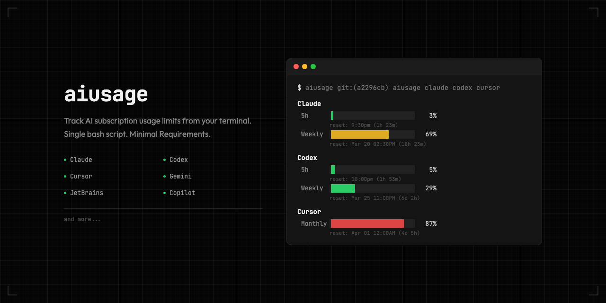

<div align="center">

# aiusage

[](./LICENSE)
[](https://github.com/frittlechasm/aiusage)



_AI subscription usage in your terminal._

</div>

## Install

```bash
chmod +x ./aiusage
```

Requires `bash`, `curl`, `jq`.

## Usage

```bash
./aiusage                         # all available providers
./aiusage claude                  # Claude only
./aiusage cursor claude           # Cursor + Claude
./aiusage codex gemini copilot    # any subset, in the order you want
```

## How it works

- Single self-contained bash script — no build step, no daemon, no framework.
- Reads local auth or quota state already present on your machine, then calls provider usage endpoints.
- Local sources include `~/.codex/auth.json`, `~/.gemini/oauth_creds.json`, Claude credentials, browser cookies for Cursor, and JetBrains quota files.
- If auth is missing, expired, or the upstream endpoint changed, that provider is shown as unavailable or returns an error line.

## Provider notes

| Provider | What it shows | Auth source |
|----------|--------------|-------------|
| Claude | `5h` and `Weekly` usage bars, extra credit usage | `claude` login credentials |
| Codex | `5h` and `Weekly` usage bars | `~/.codex/auth.json` |
| Cursor | Monthly credit or request usage | Browser cookies or `CURSOR_COOKIE` |
| Gemini | Quota usage for Google OAuth / Code Assist | `gemini` login credentials |
| JetBrains | AI credit usage from local IDE quota state | `AIAssistantQuotaManager2.xml` |
| Copilot | `Premium` and `Chat` quota bars | `COPILOT_GITHUB_TOKEN` or `copilot login` |

- Cursor session lookup is automatic from Firefox, Chrome, Arc, Brave, Edge, or Helium.
- Copilot plans with unlimited or org-managed quotas may show only the plan name instead of bars.
- Provider endpoints and response shapes can change over time.

> [!WARNING]
> **Security** — treat this as a local utility with access to existing auth state.
>
> - This script reads local auth files, local quota files, and in Cursor's case browser cookie stores. Run it only on machines you trust.
> - On macOS, extracted Cursor and Copilot credentials are cached in the login Keychain. On Linux, they are cached in `~/.cache/aiusage/` with `0600` permissions.
> - If you set `CURSOR_COOKIE` or `COPILOT_GITHUB_TOKEN` manually, avoid leaving them in shell history or dotfiles.
> - Do not commit token files, copied cookies, or cache files.
> - Because this is a plain Bash script, you can audit exactly what it reads and what URLs it calls before running it.

---

<sub>Inspired by [codexbar](https://github.com/steipete/codexbar) by [@steipete](https://github.com/steipete).</sub>
