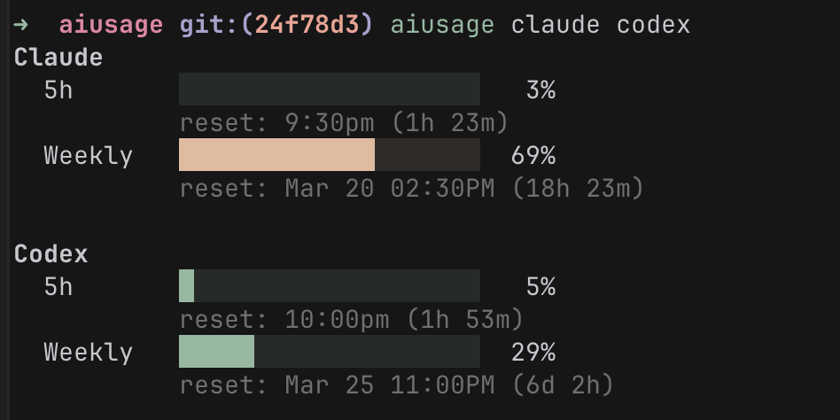

# aiusage

Tiny CLI to check AI subscription usage from a single self-contained Bash script.

No build step. No daemon. No framework. No web scraping. Just `bash`, `curl`, `jq`.

Currently supports:
- Claude
- Codex
- Cursor
- Gemini CLI
- JetBrains AI
- GitHub Copilot

## Why this is nice
- Single script: [`./aiusage`](aiusage)
- Core dependencies stay minimal: `bash`, `curl`, `jq`
- Works on anything that runs bash
- Reads the auth/session state you already have locally
- Fetches usage directly from provider-backed endpoints when available

## What it shows
- Claude `5h` and `Weekly` usage bars
- Codex `5h` and `Weekly` usage bars
- Cursor monthly credit or request usage
- Gemini CLI quota usage for Google OAuth / Code Assist accounts
- JetBrains AI credit usage from local IDE quota state
- GitHub Copilot `Premium` and `Chat` quota bars
- Local reset time for each window when the provider exposes it



## Requirements
- Required: `bash`, `curl`, `jq`
- Claude: local `claude` login
- Codex: local `codex` login
- Cursor: `sqlite3` and a supported browser logged into `cursor.com`, or set `CURSOR_COOKIE`
- Cursor on Chromium-based browsers: `python3` and `openssl` for cookie decryption
- Gemini: local `gemini` login
- JetBrains: a local JetBrains IDE with AI Assistant enabled
- Copilot: run `copilot login` or set `COPILOT_GITHUB_TOKEN`

## Install
```bash
chmod +x ./aiusage
```

## Usage
```bash
./aiusage

# Claude only
./aiusage claude

# Cursor + Claude
./aiusage cursor claude

# Any subset, in the order you want
./aiusage codex gemini jetbrains copilot
```

## How it works
- It reads local auth or quota state already present on your machine, then calls the provider usage endpoints.
- Example local sources include `~/.codex/auth.json`, `~/.gemini/oauth_creds.json`, Claude credentials, browser cookies for Cursor, and JetBrains quota files.
- If auth is missing, expired, or the upstream endpoint changed, that provider is shown as unavailable or returns an error line.

## Provider notes
- Gemini uses the OAuth login created by `gemini`; if the session is expired, run `gemini` again.
- JetBrains usage is read from the newest local `AIAssistantQuotaManager2.xml` under your JetBrains config directory.
- Cursor session lookup is automatic from Firefox, Chrome, Arc, Brave, Edge, or Helium; you can also set `CURSOR_COOKIE` manually.
- Copilot token lookup prefers `COPILOT_GITHUB_TOKEN`, then the local `aiusage` cache, then `copilot login` credentials, then plaintext `~/.copilot/config.json` fallback.
- Copilot plans with unlimited or org-managed quotas may show only the plan name instead of bars.
- Provider endpoints and response shapes can change over time.

## Security notes
Treat this as a local utility with access to existing auth state.

- This script reads local auth files, local quota files, and in Cursor's case browser cookie stores. Run it only on machines you trust.
- On macOS, extracted Cursor and Copilot credentials are cached in the login Keychain. On Linux, they are cached in `~/.cache/aiusage/` with `0600` permissions because the script avoids extra secret-storage dependencies.
- If you set `CURSOR_COOKIE` or `COPILOT_GITHUB_TOKEN` manually, avoid leaving them in shell history or dotfiles.
- Do not commit token files, copied cookies, or cache files.
- Because this is a plain Bash script, you can audit exactly what it reads and what URLs it calls before running it.


